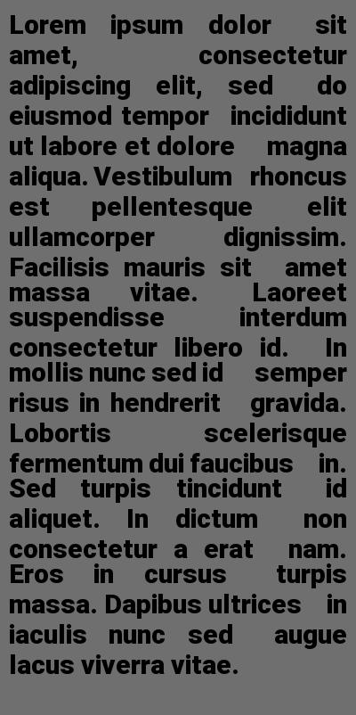

# Picture from text

Generate picture from text.
  

## Usage

```python
from text_image import IMAGE

text = 'Lorem ipsum dolor sit amet, consectetur adipiscing elit, sed do eiusmod tempor incididunt ut labore et dolore magna aliqua. Vestibulum rhoncus est pellentesque elit ullamcorper dignissim. Facilisis mauris sit amet massa vitae. Laoreet suspendisse interdum consectetur libero id. In mollis nunc sed id semper risus in hendrerit gravida. Lobortis scelerisque fermentum dui faucibus in. Sed turpis tincidunt id aliquet. In dictum non consectetur a erat nam. Eros in cursus turpis massa. Dapibus ultrices in iaculis nunc sed augue lacus viverra vitae.'
place = 'justify'
obj = IMAGE()
obj.text_image(text, 'font/unifont.ttf', font_size=30, place=place, margin=(10,10,10,10), max_width=400, color_background=(111,111,111))
```


## Result



font_size=12, color_text=(0, 0, 0),
                   color_background=(255, 255, 255),
                   place='left', margin = (0, 0, 0, 0), max_width=100, filename=None

## Variables obj.text_image()

  |Variable|Value|Default|
  | ------ | ------ | ------ |
  | text | You string | None |
  | font | Link font .ttf | None |
  | font_size | Size font | 12 |
  | color_text | RGB format color | (0, 0, 0) |
  | color_background | RGB format color | (255, 255, 255) |
  | place | Formating: center, left, right, justify | left |
  | margin | Text indent from edges. (top, right, bottom, left)  | (0, 0, 0, 0) |
  | max_width | Max width image px | 100 |
  | filename | Path to file | default.jpg |
  

## License
[MIT](https://choosealicense.com/licenses/mit/)
